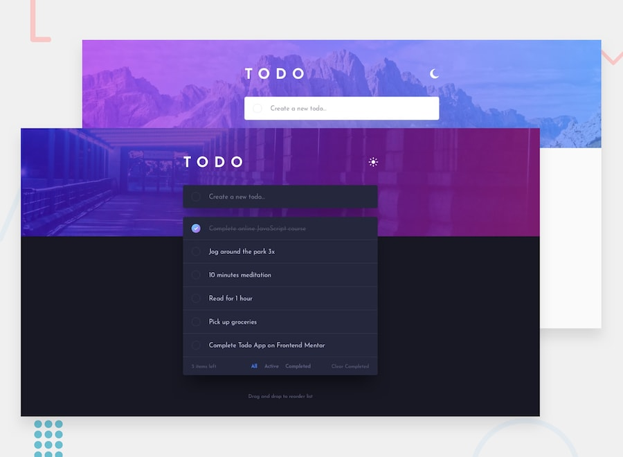
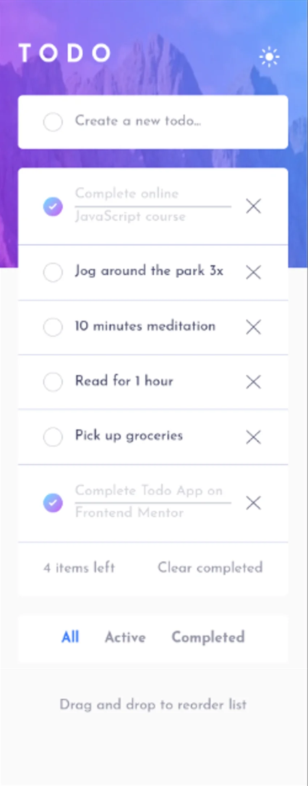
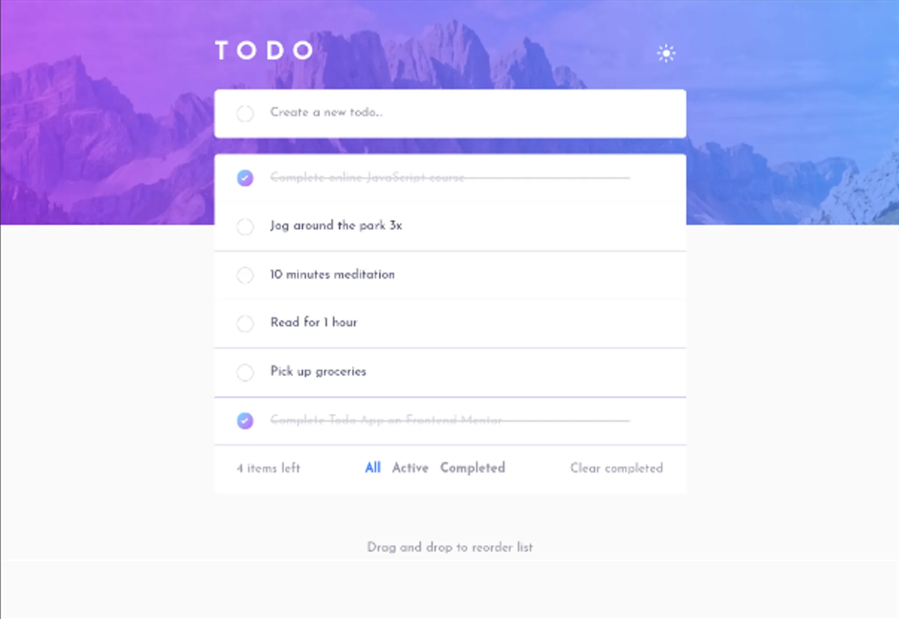
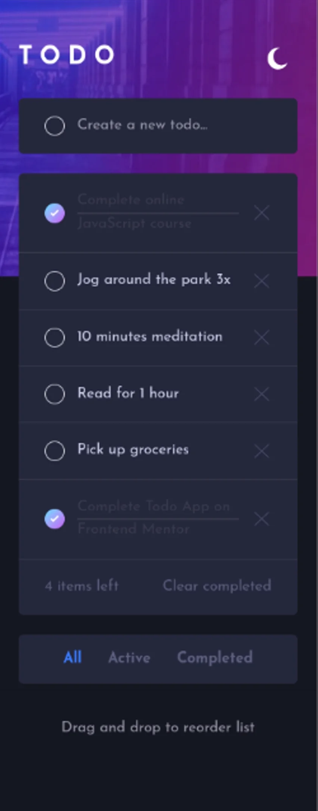
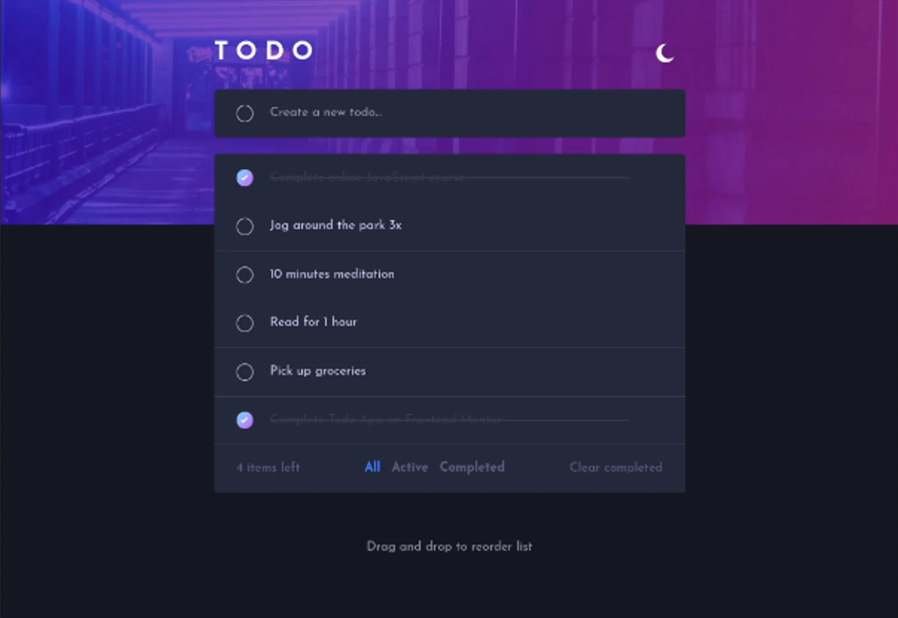

# Frontend Mentor - Todo app solution

This is a solution to the
[Todo app challenge on Frontend Mentor](https://www.frontendmentor.io/challenges/todo-app-Su1_KokOW).
Frontend Mentor challenges help you improve your coding skills by building
realistic projects.

## Table of contents

- [Overview](#overview)
  - [The challenge](#the-challenge)
  - [Screenshot](#screenshot)
  - [Links](#links)
- [My process](#my-process)
  - [Built with](#built-with)
  - [Continued development](#continued-development)
  - [AI Collaboration](#ai-collaboration)
- [Author](#author)

## Overview

### The challenge

Users should be able to:

- View the optimal layout for the app depending on their device's screen size
- See hover states for all interactive elements on the page
- Add new todos to the list
- Mark todos as complete
- Delete todos from the list
- Filter by all/active/complete todos
- Clear all completed todos
- Toggle light and dark mode
- **Bonus**: Drag and drop to reorder items on the list

### Screenshot

Target Build:

- General Overview
  

Solution Built:

- Mobile View (LIGHT MODE):
  

- Desktop View (LIGHT MODE):
  

- Mobile View (DARK MODE):
  

- Desktop View (DARK MODE):
  

### Links

- Solution URL: [GitHub Source Code](https://github.com/TonyFred-code/todo-app/)
- Live Site URL: [Vercel Deployed Demo](https://todo-app-snowy-six-77.vercel.app/)

## My process

### Built with

- Semantic HTML5 markup
- Mobile-first workflow
- [React](https://reactjs.org/) - JS library
- [TailwindCSS](https://tailwindcss.com/) - CSS framework
- [Vite](https://vite.dev/) - Build Tool
- [motion](https://motion.dev/) - Animation library

### Continued development

- In the future, a move up/down button could be added for keyboard focused
  reordering of list items.

### AI Collaboration

Work with `Claude` as described in
[AGENTS Collaboration Specification](./AGENTS.md) file

## Getting Started

### Prerequisites

Node.js (v20+ recommended)
Git

### Development Build

To run this project locally, follow these steps:

- Clone your fork of the repository:

```bash
git clone https://github.com/yourusername/todo-app.git
```

- Navigate to the project directory

```bash
cd todo-app
```

- Install dependencies

```bash
npm install
```

- Start the development server

```bash
npm run dev
```

The app will be available at: `http://localhost:5173`

### Production Build

```bash
npm run build
npm run preview
```

## Author

- Personal Website - [alfred.code](https://alfredfaith.me)
- Frontend Mentor - [@TonyFred-code](https://www.frontendmentor.io/profile/TonyFred-code)
- X (previously Twitter) - [@alfredfaith35](https://www.x.com/alfredfaith35)
